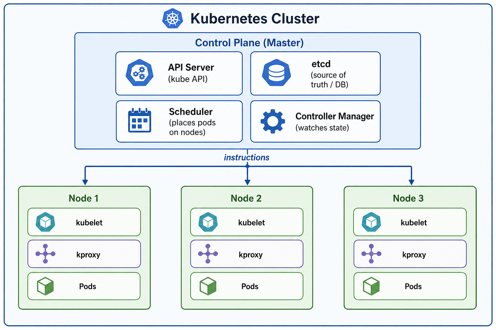
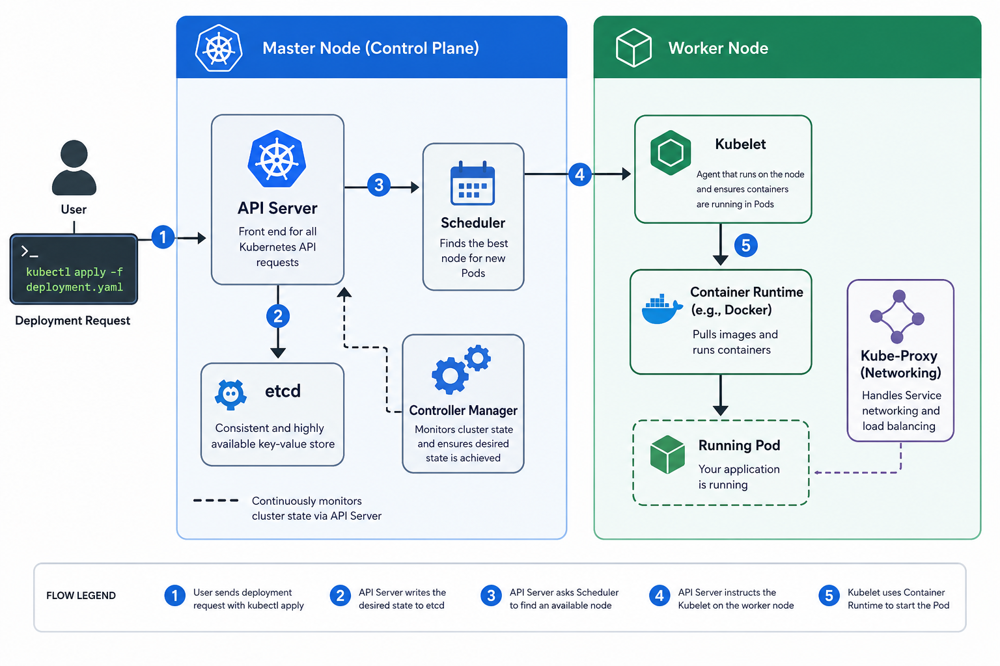

# 00 — Introduction: Docker → Kubernetes

> **Audience:** You know Docker. You can build images, write `docker-compose.yml`, and run containers. Now you want to understand Kubernetes.

---

## 🧠 Theory: From Docker to Kubernetes

### What Docker Gives You

Docker solves the "works on my machine" problem. You package your app + its dependencies into an **image**. That image runs identically anywhere Docker is installed.

```
Your code + Node.js 20 + all npm packages
         ↓ docker build
Image: ghcr.io/senghaniheet/taskflow-api:latest
         ↓ docker run
Container running on port 5000
```

### What Docker Doesn't Solve

| Problem | Docker's Answer | Reality |
|---------|----------------|---------|
| What if the container crashes? | Restart policy | Manual; fragile in production |
| How do I run 10 copies for traffic? | `docker-compose --scale` | Not production-grade |
| How do containers find each other across servers? | Custom networks | Breaks across machines |
| How do I update my app with zero downtime? | You don't, easily | Rolling updates are manual |
| What happens when a server dies? | Your container dies with it | No failover |

Kubernetes solves all of these — automatically.

### The Key Mental Shift

With Docker you say: **"Run this container."**

With Kubernetes you say: **"I want 3 healthy instances of this app running, always."**

Kubernetes figures out *how* to make that true. If a server dies, it reschedules the container elsewhere. If the container crashes, it restarts it. You declare the **desired state** and Kubernetes maintains it forever.

---

## 🏗️ Cluster Anatomy

A Kubernetes cluster has two types of machines: the **Control Plane** that makes decisions, and **Worker Nodes** that run your workloads.



**Reading this diagram from top to bottom:**

The **Control Plane (Master)** is the brain of the cluster. You never run your application here — it exists purely to manage the workers. It has four components:

- **API Server** — every action (kubectl apply, helm install, pod creation) goes through here first. It's a REST API that validates your YAML and writes it to etcd.
- **etcd** — a distributed key-value store that is the single source of truth. It stores *every* resource definition in the cluster. If etcd is lost, the cluster is lost.
- **Scheduler** — watches for pods with no assigned node and picks the best node based on available resources and affinity rules.
- **Controller Manager** — a control loop. It continuously compares *current state* vs *desired state*. If you asked for 3 API replicas and one dies, the Controller Manager notices and tells the Scheduler to create a new one.

The **arrow labelled "instructions"** represents the API Server pushing pod specifications down to each node's Kubelet.

Each **Worker Node** runs three things:

- **kubelet** — the local agent. It receives pod specs from the API Server and instructs the container runtime (containerd) to start/stop containers. It also reports node health back up.
- **kproxy** (kube-proxy) — manages the iptables/IPVS rules that make Services work. When you call `mongo:27017` from the API pod, kube-proxy is the reason traffic lands on the right pod.
- **Pods** — your actual workloads. Multiple pods run on each node, depending on how much CPU/memory each pod requests.

> **In Minikube:** all four Control Plane components AND your worker pods share the same single VM. This is fine for learning but means resource contention if you over-deploy.

### Control Plane Components

| Component | Role | Analogy |
|-----------|------|---------|
| **API Server** | The front door. All `kubectl` commands talk to it. Validates, authenticates, and persists every request. | Reception desk + security guard |
| **etcd** | A distributed key-value store. The cluster's single source of truth. Every resource you create is stored here as JSON. | The database |
| **Scheduler** | Decides which Node a new Pod should run on (based on available CPU/RAM, node affinity, taints/tolerations). | Dispatcher |
| **Controller Manager** | Watches actual vs desired state. If you asked for 3 replicas and one dies, it triggers creation of a new one. | The enforcer |

### Worker Node Components

| Component | Role |
|-----------|------|
| **Kubelet** | Agent on every node. Receives pod specs from the API Server and instructs the container runtime to start/stop containers. Reports node and pod health back up. |
| **kube-proxy** | Runs on every node. Manages the `iptables`/IPVS rules that make Services work. When you call `api:5000` from a pod, kube-proxy is what ensures the packet is forwarded to the correct destination pod with minimal network overhead — without the traffic ever leaving the node if the target pod is local. |
| **Container Runtime** | Actually runs containers (containerd, CRI-O). Docker is not used in modern K8s. |

---

## 🔄 How the Control Plane Orchestrates a Workload

Understanding the exact sequence of events from `kubectl apply` to a running pod clarifies how all four control plane components and kube-proxy work together.



> [!NOTE]
> **Why "API Server as gatekeeper"?** Every single piece of communication — from `kubectl`, from the Scheduler, from the Kubelet, from the Controller Manager — goes *through* the API Server. No component talks to etcd directly. No component talks to another component directly. The API Server is the single, enforced choke point for authentication, authorization, and validation.

---

**Next:** [01 — Setup & kubectl: Minikube and the CLI →](./01-setup-kubectl.md)
