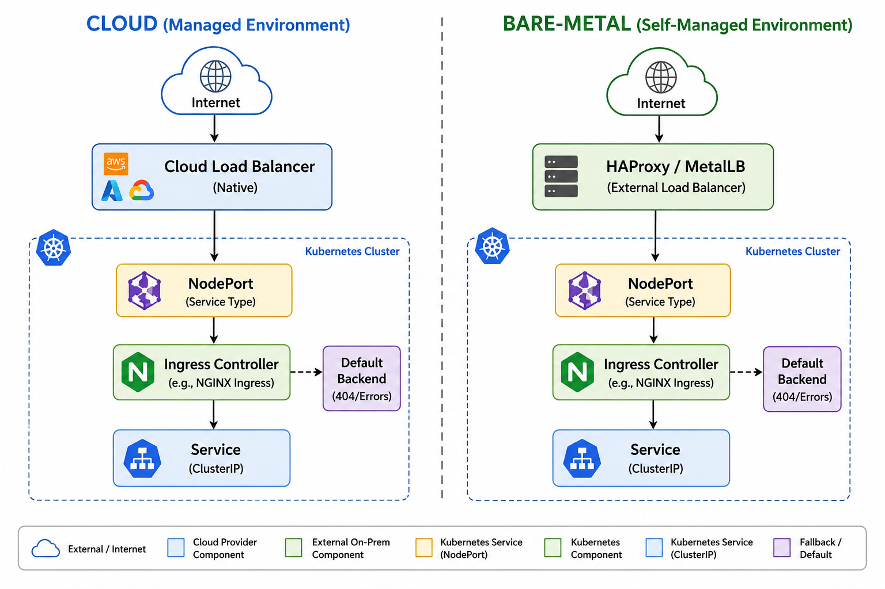

# 04 — Networking: Services, Ingress, and DNS

> **Prerequisites:** [Previous Chapter](./03-stateless-workloads.md)

---

## 🧠 Theory: The Networking Problem

Pods get random IP addresses that change every time they restart. If the API pod dies and comes back, its IP changes. How does the React app know where to send requests?

**Answer: Services.** A Service gives your pods a stable IP and DNS name that never changes — even as the underlying pods come and go.

```
Without Services:          With Services:
API pod: 10.244.0.15  →   API Service: 10.96.10.1 (stable)
(crashes)                               ↓
API pod: 10.244.0.22  →   Still: 10.96.10.1 (same IP!)
```

---

## ClusterIP — Internal Service Discovery

**ClusterIP** is the default Service type. It creates a virtual IP that is only reachable **inside** the cluster.

```
React Pod → "api:5000" → DNS lookup → ClusterIP 10.96.10.1
                                      → kube-proxy routes to one of:
                                        [api-pod-1:5000]
                                        [api-pod-2:5000]
                                        [api-pod-3:5000]
```

The ClusterIP Service acts as a **load balancer** across all matching pods.

### Selector: How Services Find Pods

The Service uses a **label selector** to find which pods to route to:

```yaml
# The Service watches for pods with these labels:
selector:
  app: api

# The Deployment creates pods WITH these labels:
template:
  metadata:
    labels:
      app: api   # ← matches the Service selector
```

When a new pod starts with matching labels, the Service automatically starts routing to it.

### Kubernetes DNS: How `mongo:27017` Works

Every Service gets a DNS entry automatically:
```
Format:   <service-name>.<namespace>.svc.cluster.local
Example:  mongo.taskflow.svc.cluster.local

Short form (within same namespace):
  mongo   ← resolves to the same address
```

This is why `MONGO_URI` is `"mongodb://mongo:27017/taskflow"` — not an IP address. The name `mongo` resolves to the Service, and the Service routes to the pod.

### Headless Services (for StatefulSets)

A regular ClusterIP returns one virtual IP for all pods. A **Headless Service** (`clusterIP: None`) returns the actual IP of each individual pod:

```
Regular Service:   mongo.taskflow.svc → 10.96.5.1 (virtual, load balanced)
Headless Service:  mongo-0.mongo.taskflow.svc → 10.244.0.5 (specific pod!)
```

StatefulSets need headless services so each pod gets a stable, individually addressable DNS name.

### Raw YAML ([k8s-scripts/service-clusterip.yaml](../k8s-scripts/service-clusterip.yaml))

```yaml
# ── API Service ──────────────────────────────────────────────
apiVersion: v1
kind: Service
metadata:
  name: api                   # DNS inside the cluster: api.taskflow.svc.cluster.local
  namespace: taskflow
spec:
  type: ClusterIP             # Internal-only; not reachable from outside the cluster
  ports:
    - name: http
      port: 5000
      targetPort: 5000
  selector:
    app: api                  # Routes to all pods carrying this label

---
# ── MongoDB Headless Service ─────────────────────────────────
apiVersion: v1
kind: Service
metadata:
  name: mongo
  namespace: taskflow
spec:
  clusterIP: None             # Headless — individual pod DNS entries instead of a VIP
  ports:
    - port: 27017
      targetPort: 27017
  selector:
    app: mongo
```

### → Try It: Apply Services and Observe Routing

```bash
# Make sure the Deployment from chapter 01 is running first
kubectl get pods -n taskflow

# Apply both Services (the file contains two objects separated by ---)
kubectl apply -f k8s-scripts/service-clusterip.yaml

# See the Services
kubectl get svc -n taskflow
# api: ClusterIP with a stable 10.x.x.x IP
# mongo: ClusterIP with None (headless)

# See the Endpoints — actual pod IPs behind the Service
kubectl get endpoints api -n taskflow
# Lists the 3 pod IPs (these change; the Service IP doesn't)

kubectl describe svc api -n taskflow
# Look for: Selector, Endpoints, Type

# Prove DNS works — exec into the API pod
kubectl exec -it <api-pod-name> -n taskflow -- sh
nslookup api          # → 10.96.x.x (ClusterIP)
nslookup mongo        # → individual pod IPs (headless)
exit

# Delete one API pod — watch the Endpoints update automatically
kubectl delete pod <api-pod-name> -n taskflow
kubectl get endpoints api -n taskflow  # New pod IP appears as old one disappears
```

> **What you just proved:** The Service IP stays constant (`10.96.x.x`), but the Endpoints list (actual pod IPs) updates live as pods come and go. The Service is the stable abstraction layer.

---

## NodePort — Exposing Outside the Cluster

NodePort exposes the Service on a static port on **every node's external IP**:

```
External client → NodeIP:30500 → kube-proxy → Service → Pod
```

- Port range: 30000–32767
- Works in Minikube without extra setup
- **Not recommended for production HTTP** — use Ingress instead

```bash
minikube ip           # → 192.168.49.2
curl http://192.168.49.2:30500/api/health
```

### Raw YAML ([k8s-scripts/service-nodeport.yaml](../k8s-scripts/service-nodeport.yaml))

```yaml
# for development/testing only; use Ingress in production
apiVersion: v1
kind: Service
metadata:
  name: api-nodeport
  namespace: taskflow
spec:
  type: NodePort
  ports:
    - port: 5000
      targetPort: 5000
      nodePort: 30500     # Static port on every node (valid range: 30000–32767)
  selector:
    app: api
```

### → Try It: Access the API via NodePort

```bash
kubectl apply -f k8s-scripts/service-nodeport.yaml

# Get the Minikube node IP
minikube ip

# Hit the API directly without Ingress
curl http://$(minikube ip):30500/api/health
# Should return: {"status":"ok","..."}

kubectl get svc api-nodeport -n taskflow
# TYPE: NodePort, PORT(S): 5000:30500/TCP

# Clean up — we'll use Ingress for real traffic
kubectl delete -f k8s-scripts/service-nodeport.yaml
```

---

## Ingress — The Smart HTTP Router

An Ingress manages **HTTP/HTTPS routing** from outside the cluster to Services inside. Think of it as a programmatic Nginx config that Kubernetes manages for you.

```
Browser: http://taskflow.local/api/workspaces

  ↓ DNS: taskflow.local → 192.168.49.2 (Minikube IP)
  ↓ Nginx Ingress Controller (listening on port 80/443)
  ↓ Reads Ingress rules
  ↓ Path: /api → Service: api:5000
  ↓ ClusterIP routes to one of the 3 API pods
  ↓ Response returned to browser
```

An Ingress **object** (YAML) is just configuration. You also need an **Ingress Controller** — the actual running reverse proxy. This project uses Nginx:

```bash
minikube addons enable ingress
```

### Raw YAML ([k8s-scripts/ingress.yaml](../k8s-scripts/ingress.yaml))

```yaml
apiVersion: networking.k8s.io/v1
kind: Ingress
metadata:
  name: taskflow-ingress
  namespace: taskflow
  annotations:
    nginx.ingress.kubernetes.io/ssl-redirect: "false"
    nginx.ingress.kubernetes.io/use-regex: "true"
spec:
  ingressClassName: nginx     # Selects the Nginx Ingress Controller

  rules:
    - host: "taskflow.local"
      http:
        paths:
          # More specific path must come first — evaluated top to bottom
          - path: /api
            pathType: Prefix
            backend:
              service:
                name: api
                port:
                  number: 5000

          - path: /
            pathType: Prefix  # Catch-all
            backend:
              service:
                name: web
                port:
                  number: 80
```

### → Try It: Apply Ingress and Test End-to-End Routing

```bash
# Enable the Nginx Ingress Controller addon (one-time setup)
minikube addons enable ingress

# Wait for the ingress controller pod to be ready
kubectl get pods -n ingress-nginx -w
# Wait until: ingress-nginx-controller-xxx  Running

# Apply the Ingress rules
kubectl apply -f k8s-scripts/ingress.yaml

# Add the hostname to your hosts file (run as Administrator on Windows)
# Open: C:\Windows\System32\drivers\etc\hosts
# Add this line:
#   192.168.49.2  taskflow.local    ← replace IP with: minikube ip

# Test the routing
curl http://taskflow.local/api/health
# → routes to the API service

curl http://taskflow.local/
# → routes to the web service

# Inspect the Ingress object
kubectl describe ingress taskflow-ingress -n taskflow
# Look for: Rules, Endpoints — shows which backend each path hits

kubectl get ingress -n taskflow
# Shows: ADDRESS (the Minikube IP), HOSTS, PORTS
```

> **What you just proved:** One Ingress object controls all external HTTP routing. The Ingress Controller (Nginx) reads it and routes accordingly — without you touching any Nginx config files directly.

---

## Cloud vs. Bare-Metal: How Traffic Gets Into the Cluster

The Ingress resource and the Nginx Ingress Controller you've configured work identically regardless of environment. What *changes* between Minikube, cloud, and bare-metal is **how external traffic gets to the Ingress Controller in the first place**.

### Minikube (Local Development)

```
Browser
  │ taskflow.local → 192.168.49.2 (via /etc/hosts)
  ▼
Minikube VM (NodePort or tunnel)
  ▼
Nginx Ingress Controller Pod
  ▼
Service (api / web) → Pods
```

`minikube tunnel` or NodePort exposes the Ingress Controller. No real external load balancer exists — just your laptop's routing table.

### Cloud (AWS / GCP / Azure) — Automatic

```
Browser
  │ taskflow.com → DNS → a1b2c3d4.elb.amazonaws.com
  ▼
Cloud Load Balancer (auto-provisioned by cloud provider)
  │ created automatically when you define Service type: LoadBalancer
  ▼
Nginx Ingress Controller Service (type: LoadBalancer)
  ▼
Nginx Ingress Controller Pods
  ▼
Service (api / web) → Pods
```

When you create a `Service` of `type: LoadBalancer` in a cloud cluster, the cloud provider's **controller** automatically provisions a native hardware load balancer (AWS ELB, GCP GCLB, Azure Application Gateway) and wires it to your cluster nodes. You pay per hour for the load balancer; you get a real external IP or hostname.

### Bare-Metal (On-Premise) — Manual

```
Browser
  │ taskflow.com → DNS → 203.0.113.10 (your server's public IP)
  ▼
External Proxy Server (HAProxy / Nginx / MetalLB)
  │ manually configured by an administrator to forward
  │ port 80/443 traffic into the cluster
  ▼
Nginx Ingress Controller NodePort Service
  ▼
Nginx Ingress Controller Pods
  ▼
Service (api / web) → Pods
```

In a bare-metal cluster, `type: LoadBalancer` does nothing — no cloud controller exists to provision hardware. You must either:
- Run **MetalLB** (a Kubernetes-native load balancer for bare-metal that assigns real IPs from a configured pool)
- Place a dedicated **external proxy** (HAProxy, Nginx) in front of the cluster to forward traffic to the Ingress Controller via NodePort

### Comparison Table

| Aspect | Minikube | Cloud (EKS/GKE/AKS) | Bare-Metal |
|--------|----------|---------------------|------------|
| **Entry point** | `minikube tunnel` / `/etc/hosts` | Auto-provisioned Cloud LB | Manual external proxy / MetalLB |
| **External IP** | Localhost / VM IP | Real cloud IP (ELB, GCLB) | Your server's public IP |
| **Cost** | Free | Pay per LB per hour | Hardware + ops cost |
| **Setup** | Zero | Zero (created automatically) | Significant manual config |
| **Ingress Controller** | Same (Nginx) | Same (Nginx) | Same (Nginx) |
| **Ingress rules** | Identical YAML | Identical YAML | Identical YAML |

> [!TIP]
> The key insight is that your **Ingress rules YAML never changes** between environments. Only the infrastructure layer that delivers traffic to the Ingress Controller differs. This is why Ingress is such a powerful abstraction — write your routing rules once, deploy anywhere.



### Default Backend: Handling Unmatched Requests

Every Ingress Controller includes a **default backend** — a fallback handler for requests that don't match any Ingress rule. Without it, unmatched requests receive a raw system-level error.

```
Request: http://taskflow.local/this-path-does-not-exist
         │
         ▼
Nginx Ingress Controller
  Checks all rules:
    /api  → api:5000      ✗ no match
    /     → web:80        ✓ catch-all match → routed to web frontend

Request: http://unknown-host.com/anything
         │
         ▼
Nginx Ingress Controller
  No host rule matches → routed to DEFAULT BACKEND
  Returns: custom 404 page or error message
```

The default backend is most important when you have **strict host-based routing** (different domains for different apps on the same cluster). You can configure a custom default backend to serve a branded 404 page:

```yaml
# In Nginx Ingress Controller Helm values (monitoring/nginx-values.yaml):
defaultBackend:
  enabled: true
  image:
    repository: nginx
    tag: alpine
  # Or point to your own custom error page service
```

```bash
# Test the default backend directly
curl -H "Host: nonexistent.example.com" http://$(minikube ip)
# → Returns the default backend's response instead of a raw connection error
```

---

## Traffic Flow: End-to-End

```
Browser (outside cluster)
    │
    │ HTTP request: taskflow.local/api/workspaces
    ▼
Minikube Node (192.168.49.2:80)
    │
    ▼
Nginx Ingress Controller
    │ Path /api → Service: api:5000
    ▼
Service: api (ClusterIP — load balances across 3 pods)
    ▼
One of: [taskflow-api-pod-1] or [taskflow-api-pod-2] or [taskflow-api-pod-3]
    │
    │ MongoDB query: mongodb://mongo:27017
    ▼
Service: mongo (Headless)
    ▼
StatefulSet Pod: taskflow-mongo-0
```

---

## 🛠️ Hands-On Challenge

**Goal:** Trace a complete request through every layer of the networking stack.

```bash
# ── Step 1: Apply everything in order ────────────────────────
kubectl apply -f k8s-scripts/namespace.yaml
kubectl apply -f k8s-scripts/configmap.yaml
kubectl apply -f k8s-scripts/secret.yaml
# ⏭️  PVC and StatefulSet are covered in Chapters 06–07 (Storage and StatefulSets).
#    Apply them after Chapter 07. The API will run without MongoDB for now;
#    requests that hit the database will return a 500, which is fine for
#    the networking exercises below.
kubectl apply -f k8s-scripts/deployment.yaml
kubectl apply -f k8s-scripts/service-clusterip.yaml
kubectl apply -f k8s-scripts/ingress.yaml

# Notice: 6 separate commands just to get a partial working stack.
# This is the exact problem we solve in Chapter 08 with Helm.

# ── Step 2: Inspect the full networking stack ────────────────
kubectl get all -n taskflow                   # Everything in one view
kubectl get endpoints -n taskflow             # Actual pod IPs behind each Service

# ── Step 3: Test internal DNS from inside the cluster ────────
kubectl exec -it <api-pod-name> -n taskflow -- sh
nslookup mongo                              # → mongo.taskflow.svc.cluster.local
nslookup api                               # → resolves to the Service ClusterIP
nslookup monitoring-grafana.monitoring     # → cross-namespace DNS works too!
exit

# ── Step 4: Watch load balancing in action ───────────────────
kubectl logs -l app=api -n taskflow -f --max-log-requests=10
# Make several requests — notice different pods handle them
```

**What to notice:**
- Services have `Endpoints` that update as pods start/stop
- DNS works across namespaces: `<service>.<namespace>`
- You needed 8 `kubectl apply` commands for a basic working stack
- Ingress routes `/api/*` to the API, everything else to the frontend

---

**Next:** [05 — Configuration: ConfigMaps and Secrets →](./05-configuration.md)