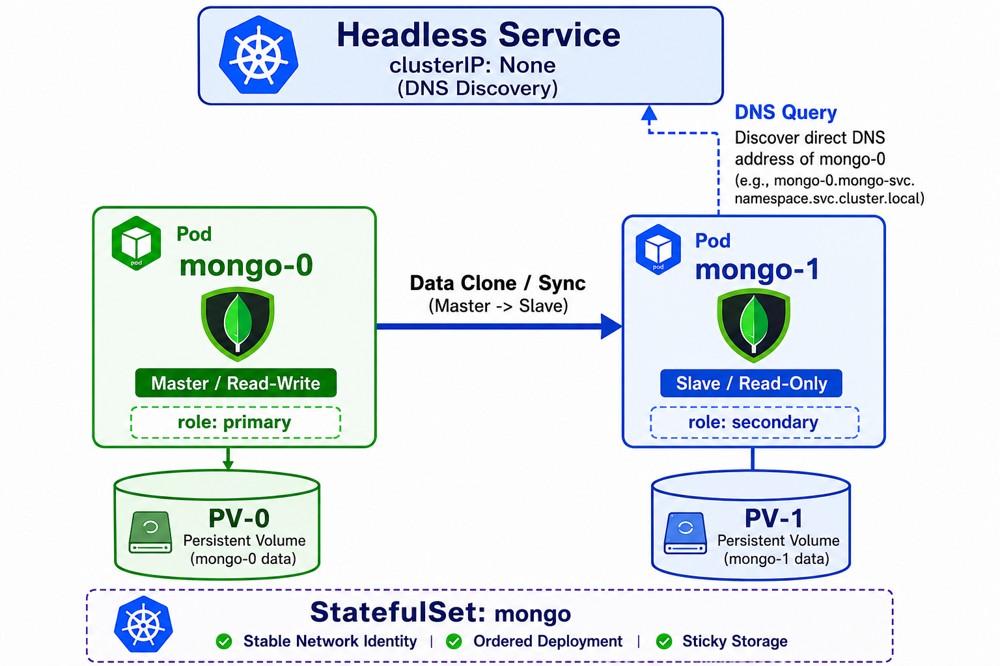

# 07 — StatefulSets: Stateful Applications & Databases

> **Prerequisites:** [06 — Storage: Persistent Volumes & Claims](./06-storage.md)

---

## 🧠 Theory: Why StatefulSets Exist

Deployments are designed for **stateless** workloads — pods are interchangeable, their names are random hashes, and they can be killed and replaced freely. **StatefulSets** exist for the opposite case: applications where every pod has a unique identity and its own dedicated storage that must survive restarts.

StatefulSets are for applications that need:
- **Stable identity:** Pod names never change (`mongo-0`, `mongo-1`)
- **Ordered deployment:** Start in order (0, 1, 2), stop in reverse (2, 1, 0)
- **Stable storage:** Each pod gets its own PVC that persists across restarts

### Deployment vs StatefulSet

| Feature | Deployment (API, Web) | StatefulSet (MongoDB) |
|---------|----------------------|----------------------|
| Pod names | Random hash (`api-abc123`) | Ordered (`mongo-0`) |
| Pod DNS | Unstable IP | `mongo-0.mongo.taskflow.svc` |
| Start order | Simultaneous | Sequential |
| Storage | Shared or none | Unique PVC per pod |
| Use case | Stateless (HTTP servers) | Stateful (databases, queues) |

---

## Raw YAML ([k8s-scripts/statefulset.yaml](../k8s-scripts/statefulset.yaml))

```yaml
apiVersion: apps/v1
kind: StatefulSet
metadata:
  name: taskflow-mongo
  namespace: taskflow
spec:
  serviceName: taskflow-mongo  # Required: links to the headless Service for stable DNS
  replicas: 1

  selector:
    matchLabels:
      app: mongo

  template:
    metadata:
      labels:
        app: mongo
    spec:
      containers:
        - name: mongo
          image: mongo:7

          resources:
            requests:
              cpu: 100m
              memory: 256Mi
            limits:
              cpu: 500m
              memory: 512Mi

          volumeMounts:
            - name: mongo-storage
              mountPath: /data/db   # MongoDB stores all data here; must persist across restarts

      volumes:
        - name: mongo-storage
          persistentVolumeClaim:
            claimName: taskflow-mongo-pvc
```

---

## → Try It: Apply and Observe a StatefulSet

```bash
# Apply the PVC first (StatefulSet needs storage before it can start)
kubectl apply -f k8s-scripts/pvc.yaml

# Create the StatefulSet
kubectl apply -f k8s-scripts/statefulset.yaml

# Notice: pods have ORDINAL names, not random hashes
kubectl get pods -n taskflow | grep mongo
# Output: taskflow-mongo-0   ← always this exact name

# See the StatefulSet status
kubectl get statefulset -n taskflow

# Delete the pod — watch it restart with the SAME name
kubectl delete pod taskflow-mongo-0 -n taskflow
kubectl get pods -n taskflow -w
# mongo-0 reappears with the same name, same PVC, same data

# Try to scale (creates mongo-0, mongo-1 in order)
kubectl scale statefulset taskflow-mongo -n taskflow --replicas=2
kubectl get pods -n taskflow -w
# mongo-1 starts ONLY after mongo-0 is Running and Ready

# Scale back down (deletes mongo-1 first, in reverse order)
kubectl scale statefulset taskflow-mongo -n taskflow --replicas=1
```

> **What you just proved:** StatefulSets give each pod a stable name and dedicated storage. The ordered, predictable naming is what makes databases like MongoDB work reliably in Kubernetes.

---

## Advanced: Why StatefulSets Are Fundamentally Different

This section goes deeper on *why* the StatefulSet design exists — and why you cannot treat a database pod the same way as a stateless API pod.

### The Synchronization Problem

A stateless API pod can be scaled freely. Every replica is interchangeable — each one reads its configuration from environment variables and produces identical output for a given input. If you have 3 API replicas and one dies, any replacement will work.

**Databases are the opposite.** Consider a MongoDB replica set with 3 members (`mongo-0` as Primary, `mongo-1` and `mongo-2` as Secondaries):

```
mongo-0 (Primary) ─── accepts writes ───────────────────────────┐
    │                                                            │
    │ replication stream                                         │
    ▼                                                            ▼
mongo-1 (Secondary) ─── reads only   ──── syncs data from mongo-0
mongo-2 (Secondary) ─── reads only   ──── syncs data from mongo-0
```

If `mongo-1` dies and a replacement pod comes up, it needs to:
1. Know it is `mongo-1` (not `mongo-2`) to rejoin the replica set with the same identity
2. Connect *directly* to `mongo-0` to clone the current data before serving reads
3. Mount the *same* storage volume it had before to resume from where it left off

If any of these three things are random or interchangeable, the replica set breaks and data becomes inconsistent.



### Sticky Identity + Persistent Volumes: The Complete Picture

The StatefulSet solves all three requirements together:

```
StatefulSet: taskflow-mongo (replicas: 2)
  │
  ├── Pod: taskflow-mongo-0
  │     │ stable DNS:  mongo-0.mongo.taskflow.svc.cluster.local
  │     └── PVC: mongo-storage-taskflow-mongo-0  ──► PV: 5Gi (dedicated)
  │                    │
  │                    └─ Survives pod restart. When mongo-0 is killed
  │                       and recreated, Kubernetes reattaches THIS exact
  │                       PV — preserving all data and the pod's role
  │                       as Primary.
  │
  └── Pod: taskflow-mongo-1
        │ stable DNS:  mongo-1.mongo.taskflow.svc.cluster.local
        └── PVC: mongo-storage-taskflow-mongo-1  ──► PV: 5Gi (dedicated)
                       │
                       └─ A completely separate volume. mongo-1's data
                          is never mixed with mongo-0's data.
```

> [!IMPORTANT]
> Each pod in a StatefulSet gets its **own dedicated Persistent Volume Claim** (created via `volumeClaimTemplates`). When a pod dies and is recreated with the same ordinal name, Kubernetes reattaches *the exact same PV* to the new pod. This means the replacement pod inherits all of the original's data — including whether it was the Primary or a Secondary — without any manual intervention.

### Headless Services: Addressing Individual Pods

A standard ClusterIP Service hides the individual pods behind a single virtual IP. This is great for stateless services (any pod will do) but fatal for databases (you need to reach `mongo-0` specifically).

A **Headless Service** (`clusterIP: None`) bypasses the virtual IP and makes each pod individually DNS-addressable:

```bash
# Inside a pod, run nslookup to see the difference:

# Standard ClusterIP Service for the API:
nslookup api
# → Server: 10.96.0.10 (CoreDNS)
# → Address: 10.96.10.1  ← ONE virtual IP, load balances across all API pods

# Headless Service for MongoDB:
nslookup mongo
# → Server: 10.96.0.10 (CoreDNS)
# → Address: 10.244.0.5  ← mongo-0's actual pod IP
# → Address: 10.244.0.8  ← mongo-1's actual pod IP

# Address individual pods directly (only possible with Headless Service):
nslookup mongo-0.mongo.taskflow.svc.cluster.local
# → Address: 10.244.0.5  ← always resolves to mongo-0, even after restart
```

The Secondary pods use this individual DNS entry to reach the Primary directly for replication — bypassing load balancing entirely.

### Production Best Practice: Keep Databases Outside Kubernetes

> [!IMPORTANT]
> **Production databases belong outside the cluster.** While this project hosts MongoDB in Kubernetes for educational purposes, managing StatefulSet-based databases in production carries significant operational complexity:
> - Manual configuration of replica set membership and promotion logic
> - Complex backup and restore procedures involving volume snapshots
> - Risk of data loss during cluster upgrades or accidental StatefulSet deletion
> - Storage class and PV lifecycle management across node failures
>
> **Recommended alternatives:** [MongoDB Atlas](https://www.mongodb.com/cloud/atlas), AWS DocumentDB, Google Cloud Firestore, or any cloud-managed database. These services handle replication, backups, and failover automatically. Your Kubernetes workloads (API, Web) remain stateless — the only part that benefits from Kubernetes orchestration — while your data tier is managed by specialists.

---

## 🛠️ Hands-On Challenge

**Goal:** Prove that StatefulSet identity and storage survive pod restarts.

```bash
# ── Part 1: Kill mongo-0 and watch it return with the same identity ──
kubectl delete pod taskflow-mongo-0 -n taskflow
kubectl get pods -n taskflow -w
# Expected: taskflow-mongo-0 restarts (not mongo-abc123) — identity is preserved

# ── Part 2: Verify the PVC is still attached ──────────────────
kubectl get pvc -n taskflow
# mongo-storage-taskflow-mongo-0 is still Bound to its PV — data survives

# ── Part 3: Prove Headless DNS ───────────────────────────────
kubectl exec -it taskflow-mongo-0 -n taskflow -- sh
nslookup taskflow-mongo-0.taskflow-mongo.taskflow.svc.cluster.local
# → Returns the pod's actual IP (not a virtual ClusterIP)
exit

# ── Part 4: Compare with Deployment (no sticky identity) ─────
kubectl delete pod <api-pod-name> -n taskflow
kubectl get pods -n taskflow
# api pod gets a NEW random name — stateless pods are interchangeable
```

**What to notice:**
- StatefulSet pods always restart with the same ordinal name
- Their PVCs remain bound even when the pod is gone
- Headless DNS resolves to the pod's actual IP, enabling direct replication links
- Deployment pods get new random names every restart — they are truly disposable

---

**Next:** [08 — Helm: Templating Engine & Package Manager →](./08-helm.md)
