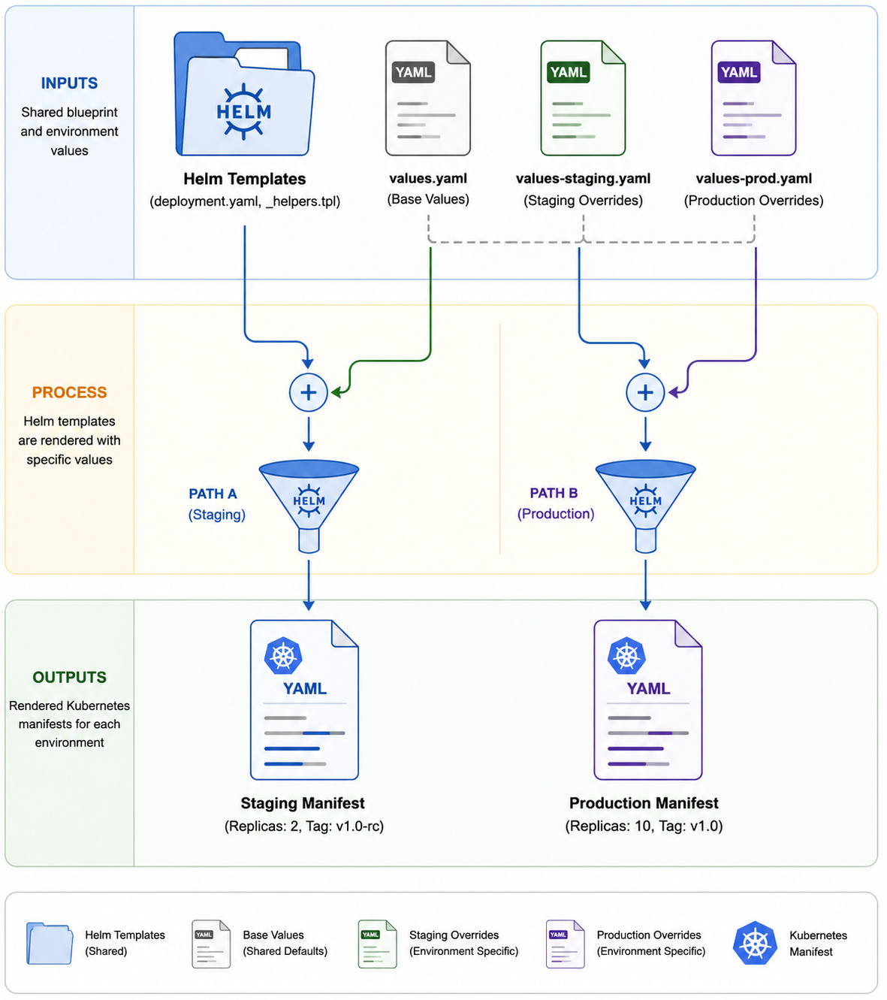

# 08 — Helm: The Package Manager for Kubernetes

> **Prerequisites:** [Previous Chapter](./07-statefulsets.md)

---

## 🧠 The Problem You Just Felt

Over the last four chapters, you applied these files one by one:

```bash
kubectl apply -f k8s-scripts/namespace.yaml
kubectl apply -f k8s-scripts/configmap.yaml
kubectl apply -f k8s-scripts/secret.yaml
kubectl apply -f k8s-scripts/pvc.yaml
kubectl apply -f k8s-scripts/statefulset.yaml
kubectl apply -f k8s-scripts/deployment.yaml
kubectl apply -f k8s-scripts/service-clusterip.yaml
kubectl apply -f k8s-scripts/ingress.yaml
kubectl apply -f k8s-scripts/hpa.yaml
kubectl apply -f k8s-scripts/pdb.yaml
```

**10 files. In a specific dependency order. With hardcoded values.**

Now imagine:
- You need a **staging** environment with 1 replica instead of 3
- You want **dev** with HPA disabled (no traffic)
- Your team member runs these in the wrong order — StatefulSet fails because PVC wasn't created yet
- You update the image tag — you have to find and edit every file that references it
- Something breaks — there's no rollback mechanism for kubectl apply

**This is exactly what Helm was built to solve.**

---

## Helm Concepts

### Chart — The Package

A **chart** is a directory of YAML templates + metadata + default values. Think of it like an npm package for Kubernetes.

```
helm/taskflow/                ← Chart root
├── Chart.yaml                ← Metadata (name, version, description)
├── values.yaml               ← Default values for all templates
└── templates/                ← Go-templated YAML files
    ├── _helpers.tpl          ← Reusable functions (never rendered as K8s objects)
    ├── namespace.yaml
    ├── api-configmap.yaml
    ├── api-secret.yaml
    ├── mongo-pvc.yaml
    ├── mongo-statefulset.yaml
    ├── mongo-service.yaml
    ├── api-deployment.yaml
    ├── api-service.yaml
    ├── web-deployment.yaml
    ├── web-service.yaml
    ├── api-hpa.yaml
    ├── web-hpa.yaml
    ├── api-pdb.yaml
    ├── web-pdb.yaml
    └── ingress.yaml
```

### Release — The Installed Instance

A **release** is a specific installed instance of a chart. You can install the same chart multiple times with different release names:

```bash
helm install prod ./helm/taskflow --set api.replicaCount=3
helm install staging ./helm/taskflow --set api.replicaCount=1
```

Both run the same chart. Different releases, different configs.

### values.yaml — The Single Source of Truth

All configurable settings live in one file. Every template pulls its values from here:

```yaml
# helm/taskflow/values.yaml (excerpt)
namespace: taskflow

api:
  replicaCount: 3
  image:
    repository: ghcr.io/senghaniheet/taskflow-api
    tag: latest
    pullPolicy: Always
  env:
    nodeEnv: "production"
    logLevel: "http"
    otelEnabled: "true"
  autoscaling:
    enabled: true
    minReplicas: 3
    maxReplicas: 10
    targetCPUUtilizationPercentage: 60
  pdb:
    enabled: true
    maxUnavailable: 1
  resources:
    requests:
      cpu: 200m
      memory: 128Mi
    limits:
      cpu: 1000m
      memory: 512Mi

mongo:
  enabled: true
  storageSize: 5Gi
```

---

## Go Template Syntax — Quick Reference

Helm uses Go's `text/template` engine. Values are injected with `{{ }}` markers.

| Syntax | What it does | Example Output |
|--------|-------------|---------------|
| `{{ .Values.api.replicaCount }}` | Insert a value | `3` |
| `{{ .Values.api.image.tag \| quote }}` | Insert as a quoted string | `"latest"` |
| `{{ .Values.api.env.logLevel \| default "info" }}` | Use default if not set | `"http"` |
| `{{ include "taskflow.fullname" . }}` | Call a helper function | `"taskflow"` |
| `{{ include "taskflow.labels" . \| nindent 4 }}` | Include + indent 4 spaces | indented labels block |
| `{{- toYaml .Values.api.resources \| nindent 12 }}` | Render YAML block indented | full resources block |
| `{{- if .Values.api.autoscaling.enabled }}` | Conditional block | file only rendered if true |
| `{{- if eq .Values.api.env.otelEnabled "true" }}` | String equality check | OTel vars only if enabled |
| `.Release.Name` | The release name (e.g. "taskflow") | `taskflow` |
| `.Release.Namespace` | The installed namespace | `taskflow` |
| `.Chart.Name` | Chart name from Chart.yaml | `taskflow` |

---

## Helm as a Templating Engine: Multi-Service Blueprinting

Beyond being a package manager, Helm's most powerful day-to-day role is as a **templating engine** that eliminates copy-paste YAML across microservices and environments.

### The DRY Problem

Imagine your project grows to three microservices: `api`, `web`, and a new `worker` service. Each needs a Deployment, Service, HPA, and PDB. Without Helm, you end up with nearly-identical YAML files:

```
k8s-scripts/
  api-deployment.yaml    ← 60 lines
  web-deployment.yaml    ← 58 lines  (99% identical to api-deployment.yaml)
  worker-deployment.yaml ← 61 lines  (99% identical to both)
```

Every time you need to add a label, change the probe path, or update the resource policy, you make the same change in three places. One missed edit causes a production incident.

**Helm's answer:** one blueprint, injected with per-service values.

```
helm/taskflow/
  templates/
    api-deployment.yaml      ← ONE template, handles all services
    _helpers.tpl              ← shared functions (labels, names, selectors)
  values.yaml                ← api:, web:, worker: each with their own overrides
```

### Environment Promotion: values-staging.yaml Pattern

The most common real-world Helm pattern is **layered values files**. A base `values.yaml` defines production defaults, and environment-specific files override only what differs:

```yaml
# values.yaml (production defaults)
api:
  replicaCount: 3
  autoscaling:
    enabled: true
    maxReplicas: 10
  resources:
    requests:
      cpu: 200m
      memory: 128Mi
```

```yaml
# values-staging.yaml (only the overrides)
api:
  replicaCount: 1          # Save resources in staging
  autoscaling:
    enabled: false         # No autoscaling needed
  resources:
    requests:
      cpu: 50m             # Minimal footprint
      memory: 64Mi
```

Deploy to each environment by layering the files:
```bash
# Production — uses values.yaml defaults
helm upgrade --install taskflow ./helm/taskflow \
  --namespace taskflow \
  --values helm/taskflow/values.yaml

# Staging — base values overridden by staging file
helm upgrade --install taskflow-staging ./helm/taskflow \
  --namespace taskflow-staging \
  --values helm/taskflow/values.yaml \
  --values helm/taskflow/values-staging.yaml   # Applied last, wins on conflicts
```



### CI/CD Injection: Zero-Touch Deployments

In a CI/CD pipeline (GitHub Actions, Jenkins, GitLab CI), the image tag changes on every commit. Helm's `--set` flag lets the pipeline inject dynamic values at deploy time without modifying any YAML files:

```bash
# In your GitHub Actions workflow:
- name: Deploy to Kubernetes
  run: |
    helm upgrade --install taskflow ./helm/taskflow \
      --namespace taskflow \
      --set api.image.tag=${{ github.sha }} \     # ← inject the Git commit SHA
      --set web.image.tag=${{ github.sha }} \
      --set api.replicaCount=3 \
      --atomic \    # Roll back automatically if deployment fails
      --timeout 5m
```

The deployed image tag is now permanently recorded in the Helm release history:
```bash
helm history taskflow -n taskflow
# REVISION  UPDATED        STATUS    CHART           DESCRIPTION
# 1         2h ago         deployed  taskflow-0.1.0  Install complete
# 2         1h ago         deployed  taskflow-0.1.0  Upgrade complete (api.image.tag=abc1234)
# 3         5m ago         deployed  taskflow-0.1.0  Upgrade complete (api.image.tag=def5678)

helm rollback taskflow 2 -n taskflow  # ← one command rolls back to the previous image
```

### Helm Registries: Distributing Charts Like Docker Images

Just like Docker images, Helm charts can be hosted and distributed via registries. This makes it easy to share production-grade, pre-configured microservice blueprints across an organization or with the open-source community.

```bash
# Public registries — browse community charts
helm repo add prometheus-community https://prometheus-community.github.io/helm-charts
helm repo add grafana https://grafana.github.io/helm-charts
helm search repo grafana/loki        # Search the registry
helm show values grafana/loki        # Inspect a chart's configurable values
helm install loki grafana/loki-stack # Install from registry (no local download needed)

# OCI-based registries (Docker Hub, GHCR, ECR) — modern standard
helm push ./helm/taskflow/ oci://ghcr.io/senghaniheet/helm-charts
helm install taskflow oci://ghcr.io/senghaniheet/helm-charts/taskflow --version 1.2.0

# Enterprise private registries (Harbor, Nexus, JFrog Artifactory)
helm repo add company-charts https://charts.internal.company.com
helm install taskflow company-charts/taskflow
```

> [!NOTE]
> Hosting your charts in a private registry means every team in your organization installs their microservices identically — same probes, same resource policies, same security headers — with only their `values.yaml` customizing the specifics. This is how platform engineering teams standardize deployments across hundreds of microservices without managing hundreds of individual YAML repos.

---

## Migration Walkthrough: From Raw YAML to Helm

The following three examples walk through the **exact same files** from `k8s-scripts/` and show how each one becomes a Helm template. Each example introduces new template concepts.

---

### Example 1 — Service (Simplest)

**What you learn:** Basic value substitution with `{{ .Values.* }}` and shared helper functions.

#### Before: Raw YAML ([k8s-scripts/service-clusterip.yaml](../k8s-scripts/service-clusterip.yaml))

```yaml
apiVersion: v1
kind: Service
metadata:
  name: api                   # ← hardcoded name
  namespace: taskflow         # ← hardcoded namespace
  labels:
    app: api
spec:
  type: ClusterIP
  ports:
    - name: http
      port: 5000
      targetPort: 5000
  selector:
    app: api
```

**The problem with this raw YAML:**
- `name: api` is hardcoded — if you install two releases, they conflict
- `namespace: taskflow` is hardcoded — can't install to a different namespace
- No consistent labels for Helm release tracking

#### values.yaml section

```yaml
# Nothing needed for basic service — namespace and name come from the release
namespace: taskflow
```

#### After: Helm Template ([helm/taskflow/templates/api-service.yaml](../helm/taskflow/templates/api-service.yaml))

```yaml
apiVersion: v1
kind: Service
metadata:
  name: api
  namespace: {{ .Values.namespace | default .Release.Namespace }}
  labels:
    {{- include "taskflow.labels" . | nindent 4 }}
    app: api
spec:
  ports:
    - name: http
      port: 5000
      targetPort: 5000
  selector:
    {{- include "taskflow.selectorLabels" . | nindent 4 }}
    app: api
  type: ClusterIP
```

**What changed and why:**

| Raw YAML | Helm Template | Reason |
|----------|--------------|--------|
| `namespace: taskflow` | `{{ .Values.namespace \| default .Release.Namespace }}` | Works for any namespace; falls back to `helm install --namespace` |
| No labels | `{{- include "taskflow.labels" . \| nindent 4 }}` | Adds `helm.sh/chart`, `app.kubernetes.io/managed-by` automatically |
| Static selector | `{{- include "taskflow.selectorLabels" . \| nindent 4 }}` | Consistent labels across all templates via one helper |

**The `_helpers.tpl` library** (what `include "taskflow.labels"` expands to):

```yaml
# helm/taskflow/templates/_helpers.tpl
{{- define "taskflow.labels" -}}
helm.sh/chart: taskflow-0.1.0
app.kubernetes.io/name: taskflow
app.kubernetes.io/instance: taskflow
app.kubernetes.io/version: "1.0.0"
app.kubernetes.io/managed-by: Helm
{{- end }}

{{- define "taskflow.selectorLabels" -}}
app.kubernetes.io/name: taskflow
app.kubernetes.io/instance: taskflow
{{- end }}
```

These helper functions are defined **once** in `_helpers.tpl` and used in all 18 templates. Without Helm, you'd copy-paste these labels into every YAML file.

---

### Example 2 — Deployment (Intermediate)

**What you learn:** Multi-field substitution, conditional replicas (when HPA is active), `toYaml` for nested blocks, and the automatic checksum annotation.

#### Before: Raw YAML ([k8s-scripts/deployment.yaml](../k8s-scripts/deployment.yaml))

```yaml
apiVersion: apps/v1
kind: Deployment
metadata:
  name: taskflow-api          # ← hardcoded
  namespace: taskflow         # ← hardcoded
spec:
  replicas: 3                 # ← hardcoded — need to edit for staging

  selector:
    matchLabels:
      app: api

  template:
    metadata:
      labels:
        app: api
      annotations:
        checksum/config: "abc123..."   # ← manually maintained!
        checksum/secret: "def456..."   # ← manually maintained!

    spec:
      containers:
        - name: api
          image: ghcr.io/senghaniheet/taskflow-api:latest  # ← hardcoded image+tag
          imagePullPolicy: Always

          envFrom:
            - configMapRef:
                name: taskflow-api-config   # ← hardcoded name
            - secretRef:
                name: taskflow-api-secret   # ← hardcoded name

          resources:
            requests:           # ← must duplicate this block in every environment
              cpu: 200m
              memory: 128Mi
            limits:
              cpu: 1000m
              memory: 512Mi
```

**The problems with this raw YAML:**
- `replicas: 3` — you need to edit the file for staging
- `image: .../taskflow-api:latest` — must edit for every image tag
- Checksum annotations are static strings — you must compute and update manually on every config change
- The `resources` block must be copy-pasted for every environment override

#### values.yaml section

```yaml
api:
  replicaCount: 3              # Change to 1 for staging: --set api.replicaCount=1
  image:
    repository: ghcr.io/senghaniheet/taskflow-api
    tag: latest                # Change for CI/CD: --set api.image.tag=abc123
    pullPolicy: Always
  autoscaling:
    enabled: true              # When true, HPA controls replicas (not spec.replicas)
  resources:
    requests:
      cpu: 200m
      memory: 128Mi
    limits:
      cpu: 1000m
      memory: 512Mi
```

#### After: Helm Template ([helm/taskflow/templates/api-deployment.yaml](../helm/taskflow/templates/api-deployment.yaml))

```yaml
apiVersion: apps/v1
kind: Deployment
metadata:
  name: {{ include "taskflow.fullname" . }}-api
  namespace: {{ .Values.namespace | default .Release.Namespace }}
  labels:
    {{- include "taskflow.labels" . | nindent 4 }}
    app: api
spec:
  {{- if not .Values.api.autoscaling.enabled }}
  replicas: {{ .Values.api.replicaCount }}
  {{- end }}
  strategy:
    type: RollingUpdate
    rollingUpdate:
      maxSurge: 1
      maxUnavailable: 0
  selector:
    matchLabels:
      {{- include "taskflow.selectorLabels" . | nindent 6 }}
      app: api
  template:
    metadata:
      annotations:
        checksum/config: {{ include (print $.Template.BasePath "/api-configmap.yaml") . | sha256sum }}
        checksum/secret: {{ include (print $.Template.BasePath "/api-secret.yaml") . | sha256sum }}
      labels:
        {{- include "taskflow.selectorLabels" . | nindent 8 }}
        app: api
    spec:
      containers:
        - name: api
          image: "{{ .Values.api.image.repository }}:{{ .Values.api.image.tag }}"
          imagePullPolicy: {{ .Values.api.image.pullPolicy }}
          envFrom:
            - configMapRef:
                name: {{ include "taskflow.fullname" . }}-api-config
            - secretRef:
                name: {{ include "taskflow.fullname" . }}-api-secret
          resources:
            {{- toYaml .Values.api.resources | nindent 12 }}
```

**What changed and why:**

| Raw YAML | Helm Template | Reason |
|----------|--------------|--------|
| `replicas: 3` | `{{- if not .Values.api.autoscaling.enabled }}` `replicas: {{ .Values.api.replicaCount }}` `{{- end }}` | When HPA is on, it controls replicas — having both causes a conflict. This removes spec.replicas when HPA is active. |
| `image: .../latest` | `"{{ .Values.api.image.repository }}:{{ .Values.api.image.tag }}"` | CI/CD can pass `--set api.image.tag=abc123` without editing YAML |
| `checksum/config: "abc123..."` | `{{ include (...) . \| sha256sum }}` | Helm computes the actual sha256 of the rendered ConfigMap every time — no manual maintenance |
| `resources: { requests: ..., limits: ... }` | `{{- toYaml .Values.api.resources \| nindent 12 }}` | The entire resources block is rendered from values — override with `--set api.resources.limits.memory=1Gi` |
| `name: taskflow-api-config` | `{{ include "taskflow.fullname" . }}-api-config` | Dynamic name prevents conflicts between releases |

---

### Example 3 — HPA (Advanced: Conditional File Creation)

**What you learn:** Using `{{- if }}` to conditionally create an entire K8s resource. This is Helm's most powerful pattern — a feature flag that determines whether a resource exists at all.

#### Before: Raw YAML ([k8s-scripts/hpa.yaml](../k8s-scripts/hpa.yaml))

```yaml
apiVersion: autoscaling/v2
kind: HorizontalPodAutoscaler
metadata:
  name: taskflow-api-hpa
  namespace: taskflow
spec:
  scaleTargetRef:
    apiVersion: apps/v1
    kind: Deployment
    name: taskflow-api
  minReplicas: 3
  maxReplicas: 10
  metrics:
    - type: Resource
      resource:
        name: cpu
        target:
          type: Utilization
          averageUtilization: 60
    - type: Resource
      resource:
        name: memory
        target:
          type: Utilization
          averageUtilization: 80
```

**The problem with this raw YAML:**
- HPA requires `metrics-server` to be installed. In a minimal dev environment, it may not be.
- `minReplicas: 3` and `maxReplicas: 10` are hardcoded — staging needs different values.
- You can't "disable" HPA without deleting the file. `kubectl delete -f hpa.yaml` is destructive.

#### values.yaml section

```yaml
api:
  autoscaling:
    enabled: true              # Set to false to disable HPA entirely
    minReplicas: 3
    maxReplicas: 10
    targetCPUUtilizationPercentage: 60
    targetMemoryUtilizationPercentage: 80
```

#### After: Helm Template ([helm/taskflow/templates/api-hpa.yaml](../helm/taskflow/templates/api-hpa.yaml))

```yaml
{{- if .Values.api.autoscaling.enabled -}}
apiVersion: autoscaling/v2
kind: HorizontalPodAutoscaler
metadata:
  name: {{ include "taskflow.fullname" . }}-api
  namespace: {{ .Values.namespace | default .Release.Namespace }}
  labels:
    {{- include "taskflow.labels" . | nindent 4 }}
    app: api
spec:
  scaleTargetRef:
    apiVersion: apps/v1
    kind: Deployment
    name: {{ include "taskflow.fullname" . }}-api
  minReplicas: {{ .Values.api.autoscaling.minReplicas }}
  maxReplicas: {{ .Values.api.autoscaling.maxReplicas }}
  metrics:
    {{- if .Values.api.autoscaling.targetCPUUtilizationPercentage }}
    - type: Resource
      resource:
        name: cpu
        target:
          type: Utilization
          averageUtilization: {{ .Values.api.autoscaling.targetCPUUtilizationPercentage }}
    {{- end }}
    {{- if .Values.api.autoscaling.targetMemoryUtilizationPercentage }}
    - type: Resource
      resource:
        name: memory
        target:
          type: Utilization
          averageUtilization: {{ .Values.api.autoscaling.targetMemoryUtilizationPercentage }}
    {{- end }}
{{- end }}
```

**What changed and why:**

| Raw YAML | Helm Template | Reason |
|----------|--------------|--------|
| Always creates HPA | `{{- if .Values.api.autoscaling.enabled -}}` wraps entire file | The entire HPA resource only exists when the flag is `true`. One flag controls a whole K8s resource. |
| `minReplicas: 3` | `{{ .Values.api.autoscaling.minReplicas }}` | Override per environment |
| No CPU/memory toggle | `{{- if .Values.api.autoscaling.targetCPUUtilizationPercentage }}` | Gracefully skip a metric if the value is unset |

**The power of this pattern:**

```bash
# Production: HPA enabled with both metrics
helm install prod ./helm/taskflow \
  --set api.autoscaling.enabled=true \
  --set api.autoscaling.targetCPUUtilizationPercentage=60

# Staging: HPA disabled (no metrics-server, save resources)
helm install staging ./helm/taskflow \
  --set api.autoscaling.enabled=false \
  --set api.replicaCount=1

# No YAMLs edited. No files deleted. One command per environment.
```

This same pattern is used in this project for:
- `mongo.enabled: false` → skips creating PVC, StatefulSet, and Service entirely
- `api.pdb.enabled: false` → skips creating the PDB
- `api.env.otelEnabled: "false"` → skips all OTel env vars in the ConfigMap

---

## The Complete Helm Workflow

### Install (First Deploy)

```bash
helm install taskflow ./helm/taskflow \
  --namespace taskflow \
  --create-namespace \
  --set api.env.jwtSecret="your-super-secret-key" \
  --set api.image.pullPolicy=Never \
  --set web.image.pullPolicy=Never

# Watch everything come up in the right order (Helm handles dependency ordering)
kubectl get pods -n taskflow -w
```

### Upgrade (Apply Changes)

```bash
# Change log level without editing any YAML
helm upgrade taskflow ./helm/taskflow \
  --namespace taskflow \
  --set api.env.logLevel="debug" \
  --reuse-values     # ← keeps all previous values, only overrides what you specify

# Preview before applying
helm diff upgrade taskflow ./helm/taskflow \
  --set api.replicaCount=5 \
  --namespace taskflow
# Shows a git-diff-style view of what would change
```

### Dry Run — Preview Generated YAML

```bash
# See all YAML Helm would generate (without touching the cluster)
helm template taskflow ./helm/taskflow \
  --set api.env.jwtSecret="test"

# Count how many K8s resources the chart creates
helm template taskflow ./helm/taskflow | grep "^kind:" | sort | uniq -c
```

### History & Rollback

```bash
helm history taskflow --namespace taskflow
# Lists all revisions: REVISION, UPDATED, STATUS, DESCRIPTION

# Rollback rolls back ALL resources (Deployment, ConfigMap, HPA, etc.)
helm rollback taskflow 1 --namespace taskflow

# Rollback just the deployment? kubectl rollout undo handles that:
kubectl rollout undo deployment/taskflow-api -n taskflow
```

### Uninstall

```bash
# Removes ALL K8s resources created by the chart
helm uninstall taskflow --namespace taskflow

# Note: PVCs are NOT deleted by default (data protection)
# Delete manually if you want to wipe storage:
kubectl delete pvc taskflow-mongo-pvc -n taskflow
```

---

## Raw YAML vs Helm: The Full Comparison

| Aspect | Raw YAML (k8s-scripts/) | Helm (helm/taskflow/) |
|--------|------------------------|----------------------|
| Deploy | 10 `kubectl apply` commands | `helm install` (one command) |
| Ordering | Manual — you must know the sequence | Helm handles it |
| Multi-environment | Duplicate files or manual edits | `--set` overrides or separate values files |
| Feature flags | Delete the file | `enabled: false` in values.yaml |
| Rollback | None (kubectl apply is one-way) | `helm rollback` — reverts all resources |
| Release tracking | None | `helm list` — full history with timestamps |
| Config drift | Easy to miss a file | `helm template` shows ground truth |
| Checksum updates | Manual | Helm calculates `sha256sum` automatically |

---

## 🛠️ Hands-On Challenge

**Goal:** Deploy the whole app with one command and experience the difference vs raw YAML.

```bash
# ── Part 1: Clean up raw YAML (if applied in previous chapters) ──

kubectl delete namespace taskflow --ignore-not-found
# This wipes all the resources you created with kubectl apply

# ── Part 2: Deploy the entire app with Helm ──────────────────

helm install taskflow ./helm/taskflow \
  --namespace taskflow \
  --create-namespace \
  --set api.env.jwtSecret="dev-secret-key" \
  --set api.image.pullPolicy=Never \
  --set web.image.pullPolicy=Never

# Watch everything come up
kubectl get pods -n taskflow -w

# ── Part 3: Compare what Helm created ────────────────────────

helm list --namespace taskflow
# Shows: NAME, NAMESPACE, REVISION, STATUS, CHART, APP VERSION

kubectl get all -n taskflow
# All resources created by a single helm install command

# ── Part 4: Upgrade with a config change ─────────────────────

helm upgrade taskflow ./helm/taskflow \
  --namespace taskflow \
  --set api.env.logLevel="debug" \
  --reuse-values

kubectl rollout status deployment/taskflow-api -n taskflow
# Watch rolling update triggered automatically by checksum change

# ── Part 5: Preview before upgrading ─────────────────────────

helm template taskflow ./helm/taskflow \
  --set api.autoscaling.enabled=false | grep -A 5 "kind: HPA" || echo "HPA not in output"
# Proves that setting enabled=false removes the HPA resource entirely

# ── Part 6: Rollback ──────────────────────────────────────────

helm history taskflow --namespace taskflow
helm rollback taskflow 1 --namespace taskflow
helm history taskflow --namespace taskflow
# Revision 3 shows: ROLLBACK → Revision 1 config restored
```

**What to notice:**
- One `helm install` replaces 10+ `kubectl apply` commands
- `--reuse-values` is critical for upgrades — prevents accidental value resets
- `helm template` is your "dry run" — always preview before upgrading production
- Rollback reverts ALL resources atomically, not just the Deployment

---

**Next:** [Next Chapter](./09-cicd.md)
