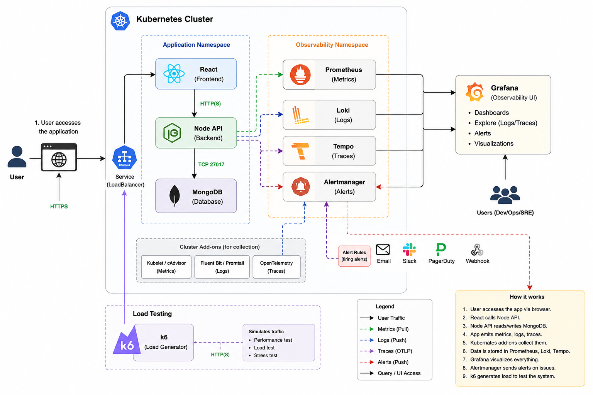

# 11 — Observability Architecture: The Three Pillars

> **Prerequisites:** [Previous Chapter](./10-reliability.md)

---

## 🧠 Theory: Why You Need Three Signals

A production system is a black box. When something goes wrong, you need to answer:

- **What** is broken? → **Metrics** (Prometheus)
- **Where** did it break? → **Logs** (Loki)
- **Why** did it break? → **Traces** (Tempo)

No single signal answers all three questions. A 500 error in metrics tells you something broke. The log tells you *which request*. The trace tells you *which database call was slow* and caused the error.

| Pillar | Tool | Data Type | Question Answered |
|--------|------|-----------|------------------|
| Metrics | Prometheus | Time-series numbers | What's happening right now? Trends? |
| Logs | Loki + Promtail | Text/JSON streams | What events happened and in what order? |
| Traces | OpenTelemetry + Tempo | Span trees | Where exactly is the latency? |

---

## Full Stack Observability Diagram

This diagram shows the **complete production observability architecture** — from a user's browser request all the way to Grafana dashboards and PagerDuty alerts.



### Reading the Diagram

The diagram is divided into four horizontal layers. Reading left to right, top to bottom:

#### Layer 1 — The Application (Application Namespace)
The `taskflow` namespace runs three services:
- **React** (Frontend) — serves the UI. Talks to the Node API over HTTP(S).
- **Node API** (Backend) — the Express.js server. The most heavily instrumented component. Emits all three observability signals.
- **MongoDB** (Database) — the StatefulSet database. Connected to the API via TCP port 27017.

#### Layer 2 — The Collection Layer (Cluster Add-ons)
These are Kubernetes-native collectors that transparently intercept and ship telemetry data **without any code changes to your app**:

| Add-on | Collects | Ships To |
|--------|---------|---------|
| **Kubelet / cAdvisor** | Pod CPU, memory, network metrics from the node | Prometheus (pull) |
| **Fluent Bit / Promtail** | stdout/stderr logs from every container via `/var/log/pods/` | Loki (push) |
| **OpenTelemetry** | Distributed trace spans from the Node API via gRPC | Tempo (push, OTLP) |

#### Layer 3 — The Storage Layer (Observability Namespace)
Three purpose-built backends, each optimised for its signal type:

- **Prometheus** — time-series metrics store. Uses a **pull** model (scrapes `/api/metrics` every 5s). Feeds the Alertmanager when rules fire.
- **Loki** — log aggregation. Uses a **push** model (Promtail pushes logs). Indexes only labels, not content — cost-efficient at scale.
- **Tempo** — distributed trace store. Accepts spans over **OTLP/gRPC (port 4317)**. Stores each request as a tree of spans showing latency per operation.
- **Alertmanager** — receives firing alerts from Prometheus and routes them to Email, Slack, PagerDuty, or Webhook.

#### Layer 4 — The Visualisation Layer
- **Grafana** — the single pane of glass. It queries Prometheus (PromQL), Loki (LogQL), and Tempo (TraceQL) and renders everything in one UI with dashboards, explore views, and alert panels.
- **Users (Dev/Ops/SRE)** — access Grafana to investigate incidents, view dashboards, and acknowledge alerts.

#### Bottom — Load Testing
- **k6** runs as a Kubernetes Pod inside the cluster. It generates synthetic HTTP traffic to the app, producing real load that you can observe across all three pillars simultaneously.

### The Complete Flow for One Request

```
1. User accesses the app via browser (HTTPS)
2. React calls Node API (HTTP)
3. Node API reads/writes MongoDB (TCP 27017)

4. Simultaneously:
   ├── OTel SDK creates spans → gRPC → Tempo        (Traces)
   ├── Winston logs to stdout → Promtail → Loki      (Logs)
   └── prom-client increments counters ← Prometheus  (Metrics)

5. Prometheus evaluates alert rules
   └── Rule fires → Alertmanager → Slack/Email/PagerDuty

6. Grafana queries all three backends
   └── Dev/Ops sees unified dashboards and explores incidents
```

## Component Reference

### 🌐 User → Ingress → Services

The entry point. All user traffic passes through the Nginx Ingress Controller (deployed as a Minikube addon). It reads Ingress rules and routes:
- `/api/*` → Node API Service → API pods
- `/` → Web Service → React frontend pods

### 🟢 Node API — The Most Instrumented Service

The Express.js API emits **all three observability signals simultaneously**:

```
Request arrives
  ↓
Winston logs it → stdout → Promtail → Loki
  ↓
OTel SDK creates a span → exports gRPC → Tempo
  ↓
prom-client increments request_total counter
  ↓
Prometheus scrapes /api/metrics every 5s
```

### 🌿 Promtail — The Log Collector (DaemonSet)

Promtail runs as a **DaemonSet** — one pod per node. It watches `/var/log/pods/` on the host filesystem where Kubernetes writes all container stdout/stderr.

```
K8s writes container stdout/stderr
  → /var/log/pods/<namespace>/<pod>/<container>.log

Promtail watches these files
  → adds K8s metadata labels (namespace, pod, container, app)
  → pushes to Loki via HTTP POST
```

**Key insight:** You don't need to change your app to ship logs to Loki. Just write to stdout. Promtail does the rest.

### 🔥 Prometheus — The Metrics Store (Pull Model)

Prometheus uses a **pull model** — it periodically scrapes `/metrics` endpoints:

```
Every 5 seconds (configured in api-servicemonitor.yaml):
  Prometheus → GET http://api-pod-ip:5000/api/metrics
  → Parses metrics: http_requests_total{method="GET", route="/api/workspaces"} 1234
  → Stores as time-series in its TSDB
```

Prometheus scrapes multiple sources:
- **Node API** → custom business metrics (via `prom-client`)
- **Kubelet/cAdvisor** → pod CPU/memory/network
- **kube-state-metrics** → Deployment status, HPA events, Pod phase
- **node-exporter** → host OS metrics (disk I/O, filesystem)

### 🪵 Loki — The Log Store

Loki is designed to be cost-efficient. Unlike Elasticsearch:
- Loki **only indexes labels** (namespace, pod, container, level)
- Log content is stored as compressed chunks, NOT indexed
- Queries filter on labels first, then parse content

```
LogQL query:
{namespace="taskflow", container="api"} | json | level = "error"
  ↑ label filter (fast, uses index)    ↑ parse json  ↑ content filter
```

### 🔍 Tempo — The Trace Store

Tempo stores distributed traces. Each trace is a tree of **spans**:

```
Trace: GET /api/workspaces (total: 45ms)
├── Express middleware (2ms)
├── JWT verification (3ms)
├── MongoDB: db.workspaces.find() (38ms)  ← this is the bottleneck!
│   └── TCP connect (1ms)
│   └── Query execution (37ms)
└── JSON serialization (2ms)
```

The OTel SDK automatically creates spans for:
- Every incoming HTTP request (Express instrumentation)
- Every MongoDB query (Mongoose/MongoDB instrumentation)
- Every outgoing HTTP call (http/https instrumentation)

### 📊 Grafana — The Unified UI

Grafana queries all backends and presents them in one interface:

```
Dashboard panel → PromQL query → Prometheus → graph
Explore tab     → LogQL query  → Loki → log viewer
Explore tab     → TraceQL      → Tempo → trace tree
```

### 🔔 Alertmanager

Prometheus evaluates alert rules every 15 seconds. When a rule fires (e.g., CPU > 80% for 5 minutes), it sends the alert to Alertmanager, which routes it to the configured receiver (Slack, email, PagerDuty).

---

## End-to-End Data Flow

```
1. User browser → HTTPS → Nginx Ingress Controller
2. Ingress → React service (UI) or Node API service (API call)
3. Node API → MongoDB query (TCP 27017)

4. OTel SDK intercepts the request:
   → Creates HTTP span + MongoDB child span
   → Exports spans via gRPC to Tempo:4317
   
5. Winston logs the request to stdout:
   → K8s writes to /var/log/pods/...
   → Promtail tails the file
   → Promtail pushes to Loki:3100

6. prom-client increments counters:
   → Prometheus scrapes /api/metrics every 5s
   → Stores time-series in TSDB

7. Grafana queries all three:
   → Metrics dashboard: pod count, CPU, RPS
   → Log dashboard: filtered by namespace, container, level
   → Trace explore: find slow spans by service name

8. Prometheus evaluates alert rules:
   → CPU > 60% for 5m → alert fires → Alertmanager
   → Alertmanager → Slack webhook / email
```

---

## 🔍 In This Project

### ServiceMonitor (how Prometheus finds the API)
**File:** [`helm/taskflow/templates/api-servicemonitor.yaml`](../helm/taskflow/templates/api-servicemonitor.yaml)

```yaml
apiVersion: monitoring.coreos.com/v1   # ← CRD provided by kube-prometheus-stack
kind: ServiceMonitor
spec:
  selector:
    matchLabels:
      app: api
  endpoints:
    - port: http
      path: /api/metrics
      interval: 5s
```

ServiceMonitor is a Prometheus Operator **Custom Resource Definition (CRD)**. The Prometheus Operator watches for ServiceMonitor objects and automatically configures Prometheus scrape targets — no manual Prometheus config files needed.

---

## 🛠️ Hands-On: Verify All Three Signals Are Working

```bash
# ── Step 1: Is Prometheus scraping the API? ───────────────────

kubectl port-forward svc/monitoring-kube-prometheus-prometheus -n monitoring 9090:9090

# Open http://localhost:9090/targets
# Look for: taskflow/taskflow-api-... → UP (green)
# If missing: check the ServiceMonitor was applied (helm install or kubectl apply)

# ── Step 2: Is Promtail shipping logs to Loki? ────────────────

kubectl port-forward svc/loki-stack -n monitoring 3100:3100 &

# Test Loki directly
curl "http://localhost:3100/loki/api/v1/labels"
# Should return: {"status":"success","data":["container","namespace","pod", ...]}

# ── Step 3: Is the API sending spans to Tempo? ────────────────

# Generate a request to create a trace
curl http://taskflow.local/api/workspaces

# Verify Tempo received it:
kubectl logs -n monitoring -l app.kubernetes.io/name=tempo --tail=20
# Look for: "level=info msg="received a span"
```

---

## 🖥️ Set Up Grafana

Now that you understand what each component does, it's time to see them all in one place.

### Step 1 — Port-Forward Grafana

```bash
kubectl port-forward svc/monitoring-grafana -n monitoring 8080:80
```

Open **http://localhost:8080** in your browser.

- **Username:** `admin`
- **Password:** `prom-operator`

> **Note:** These are the kube-prometheus-stack defaults. Keep this terminal running throughout the next chapters — all dashboard work is done here.

### Step 2 — Verify All Datasources are Connected

Go to **Home → Connections → Data Sources** and confirm all three datasources show a green **Connected** status:

| Datasource | Type | What it queries |
|------------|------|----------------|
| **Prometheus** | prometheus | CPU, memory, request rates, pod counts |
| **Loki** | loki | Application logs from all containers |
| **Tempo** | tempo | Distributed traces (request waterfalls) |

If any datasource shows an error:
```bash
# Check the backend pods are running
kubectl get pods -n monitoring

# Common fix: Prometheus is still starting up — wait 60s and retry
# Loki: kubectl logs -n monitoring -l app=loki --tail=30
# Tempo: kubectl logs -n monitoring -l app.kubernetes.io/name=tempo --tail=30
```

### Step 3 — Import the TaskFlow Metrics Dashboard

This project includes a pre-built metrics dashboard. Import it now so it's ready for the load test in the next chapter.

1. In Grafana go to **Dashboards → Import**
2. Click **Upload dashboard JSON file**
3. Select **`monitoring/taskflow-dashboard-import.json`** from the project root
4. On the next screen, set the **Prometheus** datasource and click **Import**

You will now see the **TaskFlow — Application Metrics** dashboard with these panels:

| Panel | PromQL behind it | What to look for |
|-------|-----------------|-----------------|
| **Requests / sec (RPS)** | `sum(rate(http_requests_total[2m]))` | Flat line at rest, spikes under load |
| **API Pod Count** | `kube_deployment_status_replicas_available` | Rises from 3 → up to 10 when HPA fires |
| **API CPU Utilisation %** | `rate(container_cpu_usage_seconds_total[2m])` | Crosses 60% → triggers HPA |
| **API Memory Usage (MB)** | `container_memory_usage_bytes / 1024 / 1024` | Watch for memory leaks over time |
| **HTTP Error Rate** | `rate(http_requests_total{status=~"5.."}[2m])` | Should stay at 0 during normal operation |

> **Leave this dashboard open.** In the next chapter, you will fire the k6 load test and watch every panel react in real time.

---

> **Bridge:** You now understand the architecture and have a live Grafana dashboard. In the next chapter, you will fire a realistic load test and watch the pod count panel climb as HPA auto-scales the application.

---

**Next:** [Next Chapter](./12-load-testing.md)
